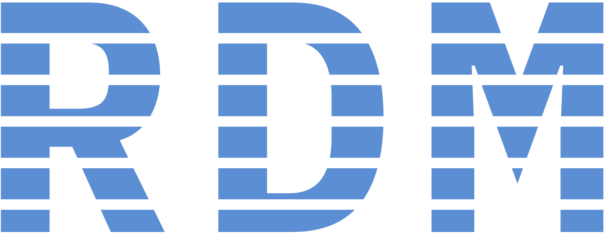

<p align="center">
  
</p>

[](https://www.gnu.org/licenses/gpl-3.0)

A zero-dependency CLI for managing project roadmaps, phases, and tasks as git-tracked markdown files.

`rdm` separates the **tool** (a compiled Rust binary) from the **plan repo** (a git-managed directory of markdown files). Your roadmaps and tasks live in the plan repo; `rdm` is how you read and write them. First-class AI agent integration means coding agents can drive the same workflows through the CLI, MCP, or REST API.

## Installation

```bash
# Homebrew (macOS)
brew install edpaget/rdm/rdm-cli

# From source
cargo install --path rdm-cli
```

Then initialize your plan repo:

```bash
export RDM_ROOT=~/Projects/my-plans
rdm init
```

## Quick Start

```bash
# Create a project
rdm project create fbm --title "Fantasy Baseball Manager"

# Create a roadmap with phases
rdm roadmap create two-way-players --project fbm --title "Two-Way Player Identity"
rdm phase create two-way-players/core-valuation --project fbm --title "Core valuation layer"
rdm phase create two-way-players/keeper-service --project fbm --title "Keeper service threading"

# Track progress
rdm phase update two-way-players/core-valuation --project fbm --status done
rdm roadmap show two-way-players --project fbm

# One-off work items
rdm task create fix-barrel-nulls --project fbm --title "Fix barrel column NULL for 2024" --priority high
rdm task update fix-barrel-nulls --project fbm --status done
```

## Core Workflow: Plan, Implement, Done

rdm is built around a three-step cycle for shipping work incrementally.

### Plan

Break work into roadmaps, each containing ordered phases. Phase bodies typically include context, implementation steps, and acceptance criteria — everything someone (or an AI agent) needs to start working.

```bash
rdm roadmap create search-feature --project fbm --title "Full-Text Search"
rdm phase create search-feature/indexing --project fbm --title "Build search index"
rdm phase create search-feature/query-api --project fbm --title "Query API endpoint"
```

For one-off work that doesn't warrant a full roadmap, create a task:

```bash
rdm task create fix-edge-case --project fbm --title "Handle empty query gracefully"
```

### Implement

Work through phases in order. Read the spec, mark it in-progress, and build:

```bash
rdm phase show search-feature/indexing --project fbm
rdm phase update search-feature/indexing --project fbm --status in-progress
```

If you discover bugs or side-work during implementation, capture them as tasks rather than fixing inline:

```bash
rdm task create unicode-tokenizer --project fbm --title "Tokenizer breaks on CJK characters"
```

### Done

When you commit the implementation, include a `Done:` line in the commit message:

```
feat(search): build inverted index for full-text search

Done: search-feature/indexing
```

Install the git hooks in your plan repo and they will automatically mark the phase done and record the commit SHA:

```bash
rdm hook install
```

The hooks parse `Done:` directives for both phases (`Done: <roadmap>/<phase>`) and tasks (`Done: task/<slug>`). This creates a traceable link from every completed item back to the commit that shipped it.

> **rdm is built with rdm.** This project's own development — roadmaps, phases, and tasks — is tracked in a separate plan repo using these same workflows.

## AI Agent Integration

rdm is designed to work with AI coding agents. Instead of granting filesystem access to your plan repo, you allowlist the `rdm` binary and the agent reads and writes roadmaps through the CLI.

### CLI Agent Config

Generate instructions and skill definitions for your agent:

```bash
# Generate CLAUDE.md instructions for a target project
rdm agent-config claude --project fbm > ~/Projects/fbm/.claude/rdm.md

# Generate Claude Code skill definitions
rdm agent-config claude --skills --project fbm --out ~/Projects/fbm/.claude/skills/
```

rdm ships with Claude Code skills covering the full lifecycle: planning (`rdm-roadmap`), implementation (`rdm-implement`), task management (`rdm-tasks`), review (`rdm-review`), and documentation generation (`rdm-document`).

### MCP Server

For agents that support [Model Context Protocol](https://modelcontextprotocol.io/), rdm exposes all operations as MCP tools — projects, roadmaps, phases, tasks, and search:

```bash
# Start the MCP server (stdio transport)
rdm mcp

# Generate .mcp.json config for MCP-aware clients
rdm agent-config --mcp --out ~/Projects/my-app
```

## REST API

For programmatic integrations beyond the CLI, `rdm serve` starts a REST API that mirrors the CLI commands. See [docs/rest-api.md](docs/rest-api.md) for endpoints, content negotiation, and error format.

```bash
rdm serve --port 8400
```

## Documentation

- [File Formats](docs/file-formats.md) — plan repo structure, YAML frontmatter reference, and field descriptions
- [Architecture](docs/architecture.md) — crate layout, Store trait, and design overview
- [Architectural Principles](docs/principles.md) — the full set of design principles governing the codebase
- [REST API](docs/rest-api.md) — endpoint reference, content negotiation, and error format
- [Bootstrap & Init](docs/bootstrap-init.md) — detailed guide to initializing and configuring a plan repo

## Contributing

rdm uses [Conventional Commits](https://www.conventionalcommits.org/en/v1.0.0/), TDD, and `cargo nextest run` for testing. See [CLAUDE.md](CLAUDE.md) for development practices and build instructions.

## License

This project is licensed under the [GNU General Public License v3.0](LICENSE).
