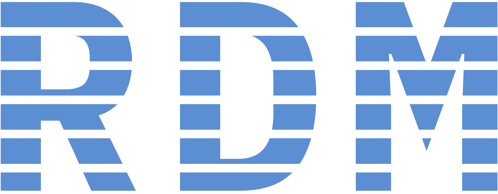

<p align="center">
  
</p>

[](https://www.gnu.org/licenses/gpl-3.0)

A tool for managing project roadmaps, phases, and tasks as git-tracked markdown files — designed to be driven by your LLM coding assistant.

Work with your assistant to plan and implement large changes in a structured, repeatable way. You only need to allowlist a single CLI tool or MCP server. Plans are stored in a separate repo to keep your codebase free of planning artifacts.

`rdm` offers CLI, MCP, and REST interfaces.

## Installation

```bash
# Quick install (Linux x86_64, macOS aarch64) — downloads a signed release binary
curl -fsSL https://github.com/edpaget/rdm/releases/latest/download/install.sh | sh

# Pin a specific release
curl -fsSL https://github.com/edpaget/rdm/releases/download/v0.6.2/install.sh | sh

# Homebrew (macOS)
brew install edpaget/rdm/rdm-cli

# npm / npx (macOS x64/arm64, Linux x64/arm64) — downloads the matching release binary on install
npx -y @edpaget/rdm mcp           # start the MCP server (default entry point for MCP clients)
npx -y @edpaget/rdm --help        # run any rdm CLI command without installing globally
npm install -g @edpaget/rdm       # or install globally so `rdm` is on PATH

# From source
cargo install --path rdm-cli
```

Open your coding assistant and ask it to run `rdm --help` and initialize the tool. Tell it whether you want to use the CLI or MCP server so it installs the correct prompts and configuration.

### Manual Initialization

Initialize your plan repo:

```bash
rdm init
```

By default, rdm stores data in `~/.local/share/rdm` (the XDG data directory). To use a custom location, pass `--root`:

```bash
rdm --root ~/Projects/my-plans init
```

## Quick Start

If you initialized using your coding assistant, it should have prompted you to create a project. The examples below show what happens under the hood — you typically won't need to run these manually.

```bash
# Create a project
rdm project create fbm --title "Fantasy Baseball Manager"

# Create a roadmap with phases
rdm roadmap create two-way-players --project fbm --title "Two-Way Player Identity"
rdm phase create two-way-players/core-valuation --project fbm --title "Core valuation layer"
rdm phase create two-way-players/keeper-service --project fbm --title "Keeper service threading"

# Track progress
rdm phase update two-way-players/core-valuation --project fbm --status done
rdm roadmap show two-way-players --project fbm

# One-off work items
rdm task create fix-barrel-nulls --project fbm --title "Fix barrel column NULL for 2024" --priority high
rdm task update fix-barrel-nulls --project fbm --status done
```

## AI Agent Integration

rdm is designed to work with AI coding agents. Instead of granting filesystem access to your plan repo, you allowlist the `rdm` binary or MCP server and the agent reads and writes roadmaps through the CLI.

### CLI Agent Config

Generate instructions and skill definitions for your agent:

```bash
# Generate CLAUDE.md instructions for a target project
rdm agent-config claude --project fbm > ~/Projects/fbm/.claude/rdm.md

# Generate Claude Code skill definitions
rdm agent-config claude --skills --project fbm --out ~/Projects/fbm

# Or generate AGENTS.md + skills for the Pi coding agent
rdm agent-config pi --skills --project fbm --out ~/Projects/fbm
```

rdm ships with Claude Code skills covering the full lifecycle: planning (`rdm-roadmap`), implementation and task work (`rdm-do`), review (`rdm-review`), acting on document reviews that request changes (`rdm-revise`) — which works a submitted review comment by comment, applying edits through rdm and landing each with `rdm commit`, recording per-comment commit provenance until the review is `addressed` — documentation generation (`rdm-document`), autonomous roadmap execution (`rdm-autopilot`) — which drives one roadmap to `reviewed` unattended (see [`docs/autonomous-loop.md`](docs/autonomous-loop.md)) — and landing (`rdm-land`), which integrates a reviewed item into `main` with linear history and then prunes its worktree (see [`docs/landing.md`](docs/landing.md)). There is also backlog grooming (`rdm-backlog`), a propose-only pass that reads `rdm backlog report` and emits a batched, human-reviewable plan of consolidate/merge/retire/archive actions — each paired with the exact `rdm` command that would carry it out — without mutating the plan repo. The same skill set is emitted for Pi under `.pi/skills/`.

#### Auto-review Stop hook (Claude Code)

Add `--hooks` (claude only, composable with `--skills`) to also install a Claude Code [Stop hook](https://docs.claude.com/en/docs/claude-code/hooks) that reprompts the agent to run the `rdm-review` skill whenever an rdm item is left in `needs-review`:

```bash
rdm agent-config claude --skills --hooks --out .
```

This writes `.claude/hooks/rdm-review-on-finalize.sh` (executable) and registers it under `hooks.Stop` in `.claude/settings.json`, merging non-destructively into any existing settings (other keys are preserved; re-running is idempotent). The hook calls `rdm` on your `PATH` and relies on standard project resolution (`RDM_PROJECT` env var or `default_project` in `rdm.toml`). Use `--user` instead of `--out` to install into `~/.claude/`.

`--hooks` also writes a second Stop hook, `.claude/hooks/rdm-plan-review-on-create.sh`, which reprompts the agent to run the `rdm-plan-review` skill while any roadmap, phase, or task carries the `needs-plan-review` sentinel tag — the tag `roadmap create` / `phase create` / `task create` stamp onto new items when the `plan_review` config key is enabled (`rdm config set plan_review true`). Both hooks register their own `hooks.Stop` entry via the same non-destructive, idempotent merge, so they coexist in one `settings.json`.

`--hooks` also works for Pi, which has no `settings.json` hooks — the equivalent is a pair of TypeScript extensions that subscribe to the `agent_end` lifecycle event:

```bash
rdm agent-config pi --skills --hooks --out .
```

This writes `.pi/extensions/rdm-review.ts` and `.pi/extensions/rdm-plan-review.ts`, which Pi auto-discovers from its extensions directory (no registration step). On every `agent_end`, `rdm-review.ts` calls `rdm` on your `PATH` (standard project resolution) and re-prompts the agent to run the `rdm-review` skill while any item is in `needs-review`; `rdm-plan-review.ts` does the same for the `rdm-plan-review` skill while any item carries the `needs-plan-review` tag. Use `--user` instead of `--out` to install into `~/.pi/agent/extensions/`.

#### Headless / unattended runs

To run the worktree + auto-review loop unattended, drive Pi in a non-interactive mode (`pi -p "<prompt>"`, or `--mode json` / `--mode rpc` for structured I/O) backed by a sandbox (OpenShell, Gondolin, or Docker) so the agent can create worktrees and apply changes without an interactive terminal.

### MCP Server

For agents that support [Model Context Protocol](https://modelcontextprotocol.io/), rdm exposes all operations as MCP tools — projects, roadmaps, phases, tasks, search, worktrees, and document reviews. The review tools (`rdm_review_requests`, `rdm_review_show`, `rdm_review_address_comment`, `rdm_review_complete`) close the revision loop: an agent discovers submitted change-request reviews, gets each comment with its anchor resolution and the referenced document bodies in one call, applies edits through the update tools (which only stage — landing each with `rdm_commit`, whose response reports the resulting commit for provenance), and drives the review to `addressed`:

```bash
# Start the MCP server (stdio transport)
rdm mcp

# Generate MCP-oriented agent instructions (references MCP tool names instead of CLI commands)
rdm agent-config --mcp --project fbm --out ~/Projects/fbm

# Generate MCP-aware Claude Code skills + .mcp.json
rdm agent-config claude --mcp --skills --project fbm --out ~/Projects/fbm
```

Pi has no native MCP support, so `rdm agent-config pi --mcp` is rejected with an actionable error. Use `rdm agent-config pi --skills` (or omit `--mcp` for the AGENTS.md integration) instead.

#### Claude Code / Cursor / MCP Registry

Register rdm with [Claude Code](https://github.com/anthropics/claude-code) (uses the published npm package):

```bash
# User-scoped (available in every project)
claude mcp add rdm -- npx -y @edpaget/rdm mcp

# Or project-scoped (writes to .mcp.json in the current repo)
claude mcp add --scope project rdm -- npx -y @edpaget/rdm mcp
```

For [Cursor](https://docs.cursor.com/context/model-context-protocol), add the
following to `~/.cursor/mcp.json` (or the project-scoped `.cursor/mcp.json`):

```json
{
  "mcpServers": {
    "rdm": {
      "command": "npx",
      "args": ["-y", "@edpaget/rdm", "mcp"]
    }
  }
}
```

rdm is also published to the [MCP Registry](https://github.com/modelcontextprotocol/registry)
under the canonical name `io.github.edpaget/rdm`.

### Claude Code web sandbox

Run Claude Code web sessions against your plan repo from a source-repo sandbox. A session-start hook installs rdm, clones the plan repo into the sandbox, and points rdm's global config at it. Drop the template into your source repo:

```bash
# From a checkout of the rdm repo:
scripts/install-claude-code-web-template.sh /path/to/your/source-repo
```

See [docs/claude-code-web.md](docs/claude-code-web.md) for the full setup, required env vars, and troubleshooting.

## Core Workflow: Plan, Implement, Done

rdm is built around a three-step cycle for shipping work incrementally.

### Plan

Break work into roadmaps, each containing ordered phases. Phase bodies typically include context, implementation steps, and acceptance criteria — everything someone (or an AI agent) needs to start working.

```bash
rdm roadmap create search-feature --project fbm --title "Full-Text Search"
rdm phase create search-feature/indexing --project fbm --title "Build search index"
rdm phase create search-feature/query-api --project fbm --title "Query API endpoint"
rdm commit -m "feat(plan): add search-feature roadmap"  # land the roadmap + phases
```

For one-off work that doesn't warrant a full roadmap, create a task:

```bash
rdm task create fix-edge-case --project fbm --title "Handle empty query gracefully"
```

### Implement

Work through phases in order. Read the spec, mark it in-progress, and build:

```bash
rdm phase show search-feature/indexing --project fbm
rdm phase update search-feature/indexing --project fbm --status in-progress
rdm commit -m "chore(plan): start indexing phase"  # land the status change
```

If you discover bugs or side-work during implementation, capture them as tasks rather than fixing inline:

```bash
rdm task create unicode-tokenizer --project fbm --title "Tokenizer breaks on CJK characters"
```

### Done

When you commit the implementation, include a `Done:` line in the commit message:

```
feat(search): build inverted index for full-text search

Done: search-feature/indexing
```

Install the git hooks in your plan repo and they will automatically mark the phase done and record the commit SHA:

```bash
rdm hook install
```

The hooks parse `Done:` directives for both phases (`Done: <roadmap>/<phase>`) and tasks (`Done: task/<slug>`). This creates a traceable link from every completed item back to the commit that shipped it.


## Worktrees

`rdm worktree` manages git worktrees in your **project (code) repo** — the git repo you invoke rdm from — keyed to plan items. It lets you (or an agent harness) spin up an isolated checkout per roadmap, phase, or task without depending on the harness's own worktree support. These commands operate on the project repo discovered from the current directory, **not** the plan repo (`RDM_ROOT`); running them from inside the plan repo is refused.

```bash
# Create (or reuse) one worktree per roadmap, shared by its phases — prints the path
rdm worktree add my-roadmap --project fbm

# Create (or reuse) a worktree for a phase — prints the worktree path
rdm worktree add my-roadmap/phase-1-indexing --project fbm

# Phase numbers are resolved against the plan repo
rdm worktree add my-roadmap/1 --project fbm

# Branch from a specific base instead of the current HEAD
rdm worktree add my-roadmap/1 --base main --project fbm

# Worktrees for standalone tasks
rdm worktree add task/fix-edge-case --project fbm

# List rdm-managed worktrees (item · branch · path · dirty)
rdm worktree list

# Remove a worktree by item or path; refuses a dirty tree without --force
rdm worktree remove my-roadmap/phase-1-indexing
rdm worktree remove my-roadmap/phase-1-indexing --delete-branch
rdm worktree remove /path/to/worktree --force
```

**Branch naming:** roadmaps use `roadmap/<slug>`; phases use `phase/<roadmap>/<stem>`; tasks use `task/<slug>`.

**Location:** worktrees are created as siblings of the project repo under `<parent>/<repo-name>__worktrees/<branch-with-slashes-as-dashes>` (e.g. `../myrepo__worktrees/phase-my-roadmap-phase-1-indexing`).

`add` is idempotent — re-running it for an existing item prints the existing path instead of erroring. Only worktrees created by rdm (tracked via an internal marker file) are listed or removable; `remove` refuses worktrees it didn't create.


## REST API

For programmatic integrations beyond the CLI, `rdm serve` starts a REST API that mirrors the CLI commands. See [docs/rest-api.md](docs/rest-api.md) for endpoints, content negotiation, and error format.

```bash
rdm serve --port 8400
```

## Documentation

- [File Formats](docs/file-formats.md) — plan repo structure, YAML frontmatter reference, and field descriptions
- [Architecture](docs/architecture.md) — crate layout, Store trait, and design overview
- [Architectural Principles](docs/principles.md) — the full set of design principles governing the codebase
- [REST API](docs/rest-api.md) — endpoint reference, content negotiation, and error format
- [Bootstrap & Init](docs/bootstrap-init.md) — detailed guide to initializing and configuring a plan repo

## Contributing

rdm uses [Conventional Commits](https://www.conventionalcommits.org/en/v1.0.0/), TDD, and `cargo nextest run` for testing. See [CLAUDE.md](CLAUDE.md) for development practices and build instructions.

### Release prerequisites

The release workflow publishes the `@edpaget/rdm` npm package via
[npm trusted publishing (OIDC)](https://docs.npmjs.com/trusted-publishers/),
so no long-lived `NPM_TOKEN` secret is required. Setup is one-time per
package:

1. Create the `@edpaget` scope on npmjs.com (only needed once for the
   whole org).
2. Bootstrap the package: npm requires a Trusted Publisher to point at
   an *existing* package, so the very first release of `@edpaget/rdm`
   has to be published manually (`npm publish --access public ...`) or
   via a one-off token. Subsequent versions go through OIDC.
3. On the `@edpaget/rdm` package settings page → Trusted Publishers,
   add a publisher pointing at `edpaget/rdm` with workflow file
   `release.yml`, environment left blank.

Once that's in place, tagging a release triggers
`.github/workflows/release.yml`, which dispatches to
`.github/workflows/publish-npm-oidc.yml` and publishes with
`npm publish --provenance` using the GitHub-issued OIDC token. The
publish workflow also injects `mcpName: io.github.edpaget/rdm` into the
published `package.json` so the MCP Registry can verify ownership.

#### Submitting to the MCP Registry

The first release that ships with `mcpName` in `package.json` unlocks the
[MCP Registry](https://github.com/modelcontextprotocol/registry)
submission. This is a manual, one-time step (subsequent releases only
need to be re-pushed to the registry if `server.json` changes):

1. Install the publisher CLI:
   ```bash
   brew install mcp-publisher
   ```
2. Bump `server.json` so its `version` (and the matching `packages[].version`)
   tracks the released npm version.
3. Authenticate with GitHub (interactive OAuth — claims the
   `io.github.edpaget` namespace):
   ```bash
   mcp-publisher login github
   ```
4. From the repo root, push `server.json` to the registry:
   ```bash
   mcp-publisher publish
   ```

## License

This project is licensed under the [GNU General Public License v3.0](LICENSE).
